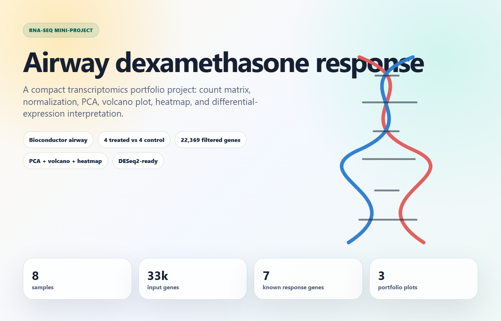
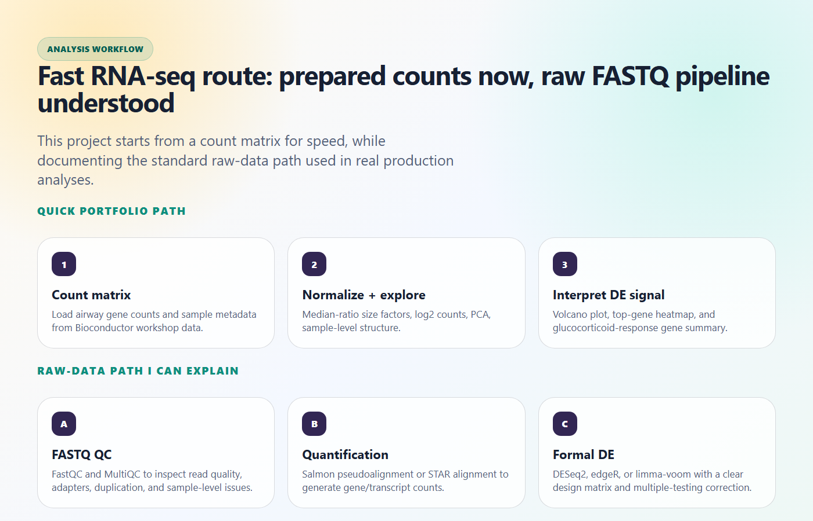
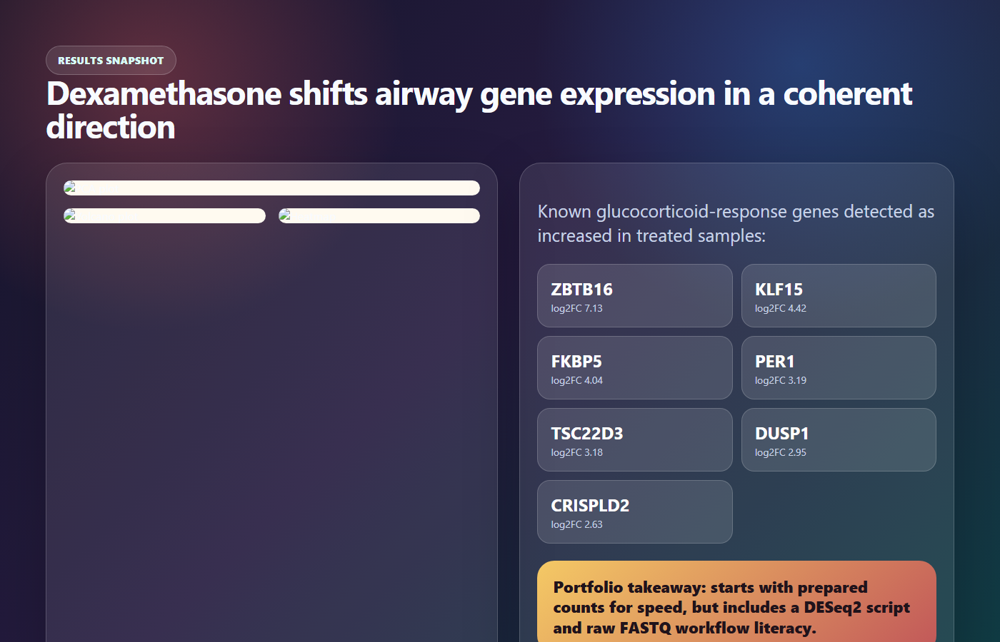
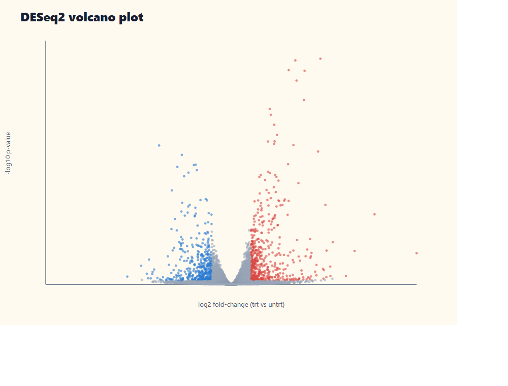

# RNA-seq mini-project: airway dexamethasone response

Mini RNA-seq differential expression project from a prepared count matrix, with exploratory Python analysis, formal DESeq2 analysis, and portfolio-ready visualization.

The project compares human airway smooth muscle cells treated with dexamethasone (`trt`) against untreated controls (`untrt`) using the public Bioconductor `airway` dataset.

## Project visuals

These overview cards are for portfolio communication. Final differential-expression interpretation should use the generated DESeq2 result files.







## Final DESeq2 result

This volcano plot is generated from the formal DESeq2 output, not from the exploratory Python approximation.



## Dataset

- Dataset: Bioconductor `airway`
- Experiment: dexamethasone-treated vs untreated airway smooth muscle cells
- Samples: 8 total
- Input used here: prepared gene-level count matrix and sample metadata
- Comparison: `dex = trt` vs `dex = untrt`

## Reproduce the analysis

1. Clone the repository and enter the project folder.

```bash
git clone <repo-url>
cd rnaseq-mini-project
```

2. Install Python dependencies.

```bash
pip install -r requirements.txt
```

3. Install R dependencies.

```bash
Rscript scripts/install_r_dependencies.R
```

4. Run exploratory analysis.

```bash
python scripts/analyze_airway.py
```

5. Run formal DESeq2 analysis.

```bash
Rscript scripts/deseq2_airway.R
python scripts/plot_deseq2_results.py
```

## Run

Exploratory Python analysis:

```bash
python scripts/analyze_airway.py
```

Formal DESeq2 analysis:

```bash
Rscript scripts/deseq2_airway.R
python scripts/plot_deseq2_results.py
```

The DESeq2 script writes:

```text
results/tables/deseq2_results.csv
results/sessionInfo.txt
```

The plotting script then writes:

```text
results/tables/deseq2_top_genes.csv
results/figures/volcano_deseq2.svg
results/figures/volcano_deseq2.png
results/results_summary.md
```

Do not treat volcano or top-gene results as final until `results/tables/deseq2_results.csv` has been generated by DESeq2.

## Outputs

Exploratory outputs:

```text
results/
|-- analysis_summary.json
|-- report.md
|-- figures/
|   |-- pca_airway.svg
|   |-- pca_airway.png
|   |-- heatmap_top_genes.svg
|   |-- heatmap_top_genes.png
|   |-- volcano_airway.svg
|   `-- volcano_airway.png
`-- tables/
    |-- de_results_approx.csv
    `-- normalized_counts_log2.csv
```

Formal DESeq2 outputs:

```text
results/
|-- figures/
|   |-- volcano_deseq2.svg
|   `-- volcano_deseq2.png
|-- tables/
|   |-- deseq2_results.csv
|   `-- deseq2_top_genes.csv
|-- results_summary.md
`-- sessionInfo.txt
```

## DESeq2 model

The DESeq2 script uses:

```r
design = ~ cell + dex
```

This controls for donor/cell-line effects (`cell`) while testing the dexamethasone treatment effect (`dex`). Genes are filtered with:

```r
rowSums(counts(dds)) >= 10
```

The reported contrast is:

```r
contrast = c("dex", "trt", "untrt")
```

## Interpretation

In the airway dataset, dexamethasone treatment is expected to increase known glucocorticoid-response genes. Good positive-control genes to look for include:

- `FKBP5`
- `DUSP1`
- `KLF15`
- `PER1`
- `TSC22D3`
- `ZBTB16`
- `CRISPLD2`

After `deseq2_results.csv` is generated, the volcano plot and top-gene table should be interpreted from DESeq2 statistics (`log2FoldChange`, `pvalue`, `padj`), not from approximate Python p-values.

## What this shows biologically

The DESeq2 result shows a strong transcriptional response to dexamethasone in airway smooth muscle cells. Several known glucocorticoid-response genes, including `DUSP1`, `PER1`, and `KLF15`, appear among the top DESeq2-ranked genes, which supports that the dataset captures the expected biological signal. In practical terms, the analysis demonstrates how a prepared RNA-seq count matrix can be used to move from exploratory plots to a statistically grounded differential-expression result.

## Raw FASTQ production workflow

This mini-project intentionally starts from a prepared count matrix for speed and clarity. A production RNA-seq workflow from raw reads would usually include:

- FastQC for per-sample read quality checks
- MultiQC to aggregate QC reports
- trimming if adapters or low-quality bases are present
- Salmon for transcript quantification or STAR for genome alignment
- gene-level summarization/count matrix generation
- DESeq2, edgeR, or limma-voom for differential expression
- nf-core/rnaseq for a standardized reproducible pipeline

## Limitations

This mini-project starts from a prepared count matrix. It does not perform raw FASTQ QC/alignment, but the expected production workflow would include FastQC, MultiQC, Salmon/STAR, and nf-core/rnaseq.

The current `results/report.md` summarizes exploratory Python results. Formal differential-expression claims should be based on `scripts/deseq2_airway.R` and the generated `results/tables/deseq2_results.csv`.

## What I learned

- How to work with a prepared RNA-seq count matrix
- How to separate exploratory visualization from formal statistical testing
- How to control for donor/cell-line effects in DESeq2
- How to interpret PCA, volcano plots, and heatmaps
- Why raw FASTQ processing and count-matrix analysis are separate workflow stages

## References

- Bioconductor `airway` experiment data package
- DESeq2 documentation and Bioconductor RNA-seq workflows
- Galaxy Training reference-based RNA-seq workflow
- nf-core/rnaseq
